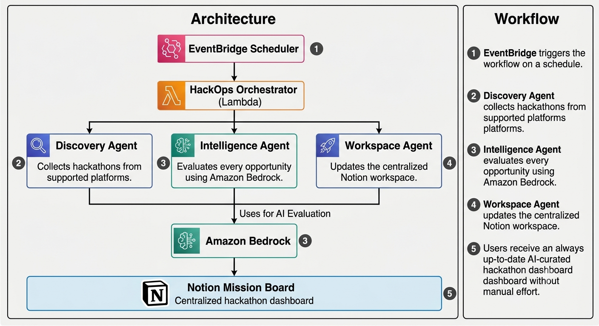

<h1 align="center">🚀 HackOps AI</h1>

<p align="center">
  <strong>An autonomous multi-agent system that discovers hackathons from Devpost, Devfolio & Unstop, evaluates them with Amazon Bedrock AI, and delivers a curated Notion dashboard — completely hands-free.</strong>
</p>

<p align="center">
  
  
  
  
  
</p>

<p align="center">
  <a href="#how-it-works">How It Works</a> •
  <a href="#live-dashboard">Live Dashboard</a> •
  <a href="#demo">Demo</a> •
  <a href="#architecture">Architecture</a> •
  <a href="#deployment">Deployment</a>
</p>

---

## How It Works

```
Empty Notion Database  →  Lambda Trigger  →  72 AI-analyzed hackathons in ~2 minutes
```

| Step | Agent | What it does |
|------|-------|-------------|
| 1 | **Discovery Agent** | Scrapes Devpost, Devfolio, Unstop — visits detail pages for deadlines, prizes, themes, team size |
| 2 | **Intelligence Agent** | Sends each hackathon to Amazon Bedrock Nova Micro for strategic analysis (priority, difficulty, winning %, recommended stack) |
| 3 | **Workspace Agent** | Syncs to Notion with deduplication, serial numbers, expired entry archiving, and rate limit handling |

The pipeline runs **automatically every day** via Amazon EventBridge — no manual intervention.

---

## Live Dashboard

> 🔗 **[View the Hackathon Tracker on Notion](https://app.notion.com/p/3a00cf259e9e8064a44efecb2cf3ab32?v=3a00cf259e9e801d8c59000c72b76a4d)**

Browse the live, auto-updated hackathon database with AI-curated insights — priorities, difficulty ratings, winning probability, and recommended tech stacks for each opportunity.

<p align="center">
  
  <br/>
  <em>AI-curated hackathon dashboard — auto-populated by the pipeline</em>
</p>

---

## Demo

The database starts **completely empty**. One Lambda invocation discovers 70+ hackathons, runs AI analysis, and populates the entire dashboard.

<p align="center">
  
  <br/>
  <em>Before — Empty Hackathon Tracker</em>
</p>

<p align="center">
  <a href="https://youtu.be/uiK-voe0Y40">
    
  </a>
  <br/>
  <em>▶ Click to watch the full demo on YouTube</em>
</p>

**What happens in the video:**
1. Empty Notion database shown
2. AWS Lambda triggered from the console
3. Pipeline runs: Discovery → Intelligence → Workspace
4. Notion fills with 70+ hackathons — complete with AI-generated priorities, strategies, and tech stack recommendations
5. EventBridge daily schedule shown

---

## Architecture

<p align="center">
  
</p>

```
┌─────────────────────────────────────────────────────────────┐
│                    Amazon EventBridge                         │
│                   (Daily Cron Trigger)                        │
└─────────────────────────┬───────────────────────────────────┘
                          │
                          ▼
┌─────────────────────────────────────────────────────────────┐
│               HackOps Orchestrator (Lambda)                   │
│          Python 3.13 • 512MB • 300s timeout                  │
└────────┬──────────────────┬──────────────────┬──────────────┘
         │                  │                  │
         ▼                  ▼                  ▼
┌────────────────┐  ┌───────────────┐  ┌───────────────┐
│  Discovery     │  │ Intelligence  │  │  Workspace    │
│  Agent         │  │ Agent         │  │  Agent        │
│                │  │               │  │               │
│ • Devpost      │  │ • Bedrock     │  │ • Create      │
│ • Devfolio     │  │   Nova Micro  │  │ • Update      │
│ • Unstop       │  │ • Mock        │  │ • Archive     │
│                │  │   Fallback    │  │ • Dedup       │
└────────────────┘  └───────────────┘  └───────┬───────┘
                                               │
                                               ▼
                                    ┌───────────────────┐
                                    │  Notion Database   │
                                    │  (Mission Board)   │
                                    └───────────────────┘
```

---

## Features

| Feature | Description |
|---------|-------------|
| 🔍 **Multi-Platform Discovery** | Scrapes Devpost, Devfolio, and Unstop with pagination and detail page visits |
| 🧠 **AI Analysis** | Amazon Bedrock Nova Micro evaluates priority, difficulty, winning probability, and recommends tech stacks |
| 🔄 **Smart Sync** | Deduplication by (title, platform), auto-incrementing serial numbers, expired entry archiving |
| 🛡️ **Resilient** | Retry with backoff, graceful degradation, per-item fallback — never halts the pipeline |
| ⏰ **Fully Automated** | EventBridge triggers daily — zero manual intervention |
| 🧪 **240+ Tests** | Unit, property-based (Hypothesis), and integration tests |

---

## Tech Stack

| Layer | Technology |
|-------|-----------|
| **Runtime** | Python 3.13, AWS Lambda |
| **AI** | Amazon Bedrock (Nova Micro, ap-south-1) |
| **Scheduling** | Amazon EventBridge |
| **Database** | Notion API |
| **Scraping** | requests, BeautifulSoup4 |
| **Testing** | pytest, Hypothesis |

---

## Project Structure

```
hackops-ai/
├── lambda_function.py          # Lambda entry point (orchestrator)
├── main.py                     # Local development runner
├── agents/
│   ├── discovery_agent.py      # Multi-platform scraper
│   ├── intelligence_agent.py   # Bedrock AI + mock fallback
│   └── workspace_agent.py      # Notion CRUD with dedup & archiving
├── models/
│   └── hackathon.py            # Dataclasses: Hackathon, EnrichedHackathon, SyncResult
├── utils/
│   ├── dates.py                # Date normalization (9+ formats → ISO 8601)
│   └── validation.py           # Input validation
├── tests/                      # 240+ tests
├── deploy/                     # IAM policies + packaging script
└── demo/                       # Architecture diagram + demo assets
```

---

## Deployment

### Quick Deploy

```bash
# Clone
git clone https://github.com/5anjay-s/hackops-ai.git && cd hackops-ai

# Create IAM role
aws iam create-role --role-name hackops-lambda-role \
  --assume-role-policy-document file://deploy/trust-policy.json
aws iam put-role-policy --role-name hackops-lambda-role \
  --policy-name hackops-bedrock-logs \
  --policy-document file://deploy/bedrock-policy.json

# Package & deploy
pip install -t deploy/package -r requirements.txt
cp lambda_function.py deploy/package/ && cp -r agents models utils deploy/package/
python deploy/make_zip.py
aws lambda create-function --function-name hackops-orchestrator \
  --runtime python3.13 --handler lambda_function.lambda_handler \
  --role arn:aws:iam::<ACCOUNT>:role/hackops-lambda-role \
  --zip-file fileb://deploy/hackops-lambda.zip \
  --timeout 300 --memory-size 512 \
  --environment "Variables={NOTION_TOKEN=<token>,DATABASE_ID=<db_id>}"

# Schedule daily
aws events put-rule --name hackops-daily-trigger \
  --schedule-expression "rate(1 day)" --state ENABLED
```

### Run Locally

```bash
pip install -r requirements.txt
cp .env.example .env   # Add your tokens
python main.py
```

### Run Tests

```bash
pytest tests/ -v
```

---

## Notion Database Schema

| Column | Type | Source |
|--------|------|--------|
| S.No | Number | Auto-incremented |
| Hackathon | Title | Name |
| Platform | Select | Devpost / Devfolio / Unstop |
| Deadline | Date | Registration deadline |
| Submission Deadline | Date | Submission deadline |
| Themes | Multi-select | Tags |
| Prize | Rich Text | Prize pool |
| Team Size | Rich Text | Requirement |
| Priority | Select | AI: High / Medium / Low |
| Difficulty | Select | AI: Easy / Medium / Hard |
| Winning % | Number | AI: 0-100 |
| Suggested Stack | Multi-select | AI: Tech recommendations |
| Execution Strategy | Rich Text | AI: Battle plan |
| Status | Status | In progress / Done |
| Registration Link | URL | Direct link |
| Last Synced | Date | UTC timestamp |

---

## Environment Variables

| Variable | Description |
|----------|-------------|
| `NOTION_TOKEN` | Notion integration secret |
| `DATABASE_ID` | Target database ID |
| `AWS_REGION` | AWS region (default: `ap-south-1`) |

---

<p align="center">
  <sub>Built with ☕ and AWS • <a href="https://github.com/5anjay-s/hackops-ai">Star this repo</a> if you found it useful</sub>
</p>
